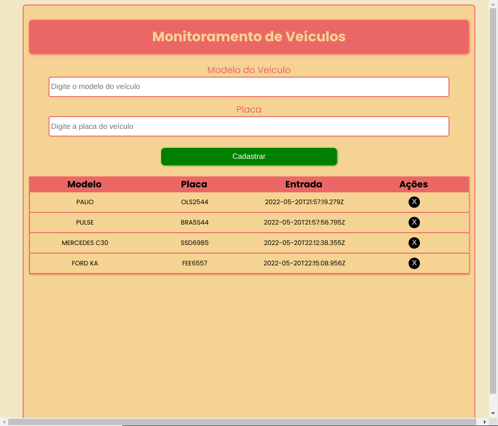

##	Sistema Básico de Estacionamento

Projeto desenvolvido durante bootcamp na plataforma Digital Innovation One. Trata-se de um sistema básico de estacionamento, cujas funções são controlar os veículos do pátio e calcular tempo de permanência no local. Os dados do automóvel são inseridos na tela e salvos no Local Storage e todos os veículos presentes no pátio são exibidos na interface. 

### Tecnologias Utilizadas

- HTML;
- CSS;
- TypeScript.

### Como Utilizar

- Clone o repositório:

  ```cmd
  git clone https://github.com/joao-victor-dias/dio-sistema-estacionamento.git
  ```

- Utilize o comando para gerar o arquivo script.js quando modificar o arquivo script.ts:

  ```cmd
  npx -p typescript tsc
  ```

- Execute o arquivo index.html ou se preferir utilize a extensão Live Server do VS Code para gerar um servidor para o projeto.

### Interface

